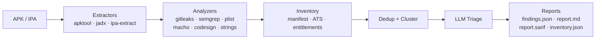

# mobiscope

Static analysis harness for **Android APKs** and **iOS IPAs**. It orchestrates
external tools (apktool, jadx, gitleaks, semgrep and an iOS analyzer set) and
uses LLMs to triage, correlate and explain security findings.

> **Provider-agnostic**: Ollama, llama.cpp, LM Studio, vLLM, OpenAI,
> Anthropic, Gemini, Groq, OpenRouter and any OpenAI-compatible API.

## Overview



## Install

```bash
git clone https://github.com/dedek0/mobiscope.git
cd mobiscope
make build

# External tools (optional, for full analysis)
# Android: apktool, jadx, gitleaks, semgrep, apksigner
# iOS:     none required (in-process); ldid/llvm-objdump optional
```

### Docker

The image ships the full toolchain (`mobiscope`, `gitleaks`, `semgrep`,
`apktool`, `jadx`, JRE). Analysis runs as a non-root user.

```bash
docker build -t mobiscope .

docker compose up mobiscope                          # app only
docker compose --profile local-llm up -d             # + Ollama (CPU)
docker compose --profile local-llm-gpu up -d         # + Ollama (NVIDIA)

docker compose run --rm mobiscope analyze /app/samples/app.apk --triage
docker compose run --rm mobiscope analyze /app/samples/app.ipa --triage
```

| Host path | Purpose |
|-----------|---------|
| `./samples/` | APK/IPA inputs (read-only mount) |
| `./targets/` | Analysis output |
| `./config.toml` | Optional config (uncomment the mount) |

The published port binds `127.0.0.1` only. See [SECURITY.md](SECURITY.md)
before exposing the API.

> **Note.** `codesign`, `otool`, `plutil` and `class-dump` are macOS-only.
> Inside the container iOS analysis uses the Linux-capable subset.

## Usage

```bash
# Android
./bin/mobiscope analyze app.apk
./bin/mobiscope analyze app.apk --stages apktool,jadx,gitleaks,semgrep

# iOS
./bin/mobiscope analyze app.ipa

# With LLM triage
./bin/mobiscope analyze app.apk --triage
./bin/mobiscope analyze app.apk --triage --triage-provider anthropic --allow-cloud

# Verify the binary is the one you meant to analyze
./bin/mobiscope analyze app.apk --expect-sha256 <hex>

# List stages without running
./bin/mobiscope analyze app.apk --dry-run

# Abort on first tool error; run N tools at a time
./bin/mobiscope analyze app.apk --fail-fast --max-concurrency 2
```

### LLM management

```bash
./bin/mobiscope llm detect
./bin/mobiscope llm config
./bin/mobiscope llm health
./bin/mobiscope llm list
./bin/mobiscope llm models
./bin/mobiscope llm test --task triage
./bin/mobiscope llm pull qwen2.5-coder:7b
```

### Global flags

```
--config <path>      TOML config file
--provider <name>    Override the LLM provider for all tasks
--allow-cloud        Permit cloud LLM providers
```

## Configuration

### Precedence

```
built-in defaults  <  TOML file  <  environment variables  <  CLI flags
```

Later layers win. CLI flags only apply when explicitly set. Cross-field rules
are validated at load time: `llm.default_provider` and every
`llm.tasks.*.provider` must reference a defined `[llm.providers.<name>]`.

### File discovery

1. `--config /path/to/config.toml`
2. `$MOBISCOPE_CONFIG`
3. `./config.toml` → `./mobiscope.toml`
4. `~/.config/mobiscope/config.toml` → `~/.mobiscope/config.toml`

```bash
cp deploy/config.example.toml config.toml
```

### TOML example

```toml
[llm]
default_provider = "ollama"
allow_cloud = false
allow_cloud_secrets = false
max_retries = 3
retry_base_delay_ms = 500
timeout_seconds = 60

[pipeline]
max_concurrency = 4
fail_fast = false

[llm.tasks.triage]
provider = "ollama"
model = "qwen2.5-coder:7b"

[llm.providers.ollama]
base_url = "http://localhost:11434"

# [llm.providers.openai]
# type = "openai_compatible"
# preset = "openai"
# api_key_env = "OPENAI_API_KEY"
```

`[llm.providers.<name>]` is a free-form map: add as many providers as you
want. `type` is one of `ollama`, `openai`, `openai_compatible`, `anthropic`,
`gemini` (or a preset name, which implies `openai_compatible`).

### Environment variables

Generic overrides use `MOBISCOPE_` with `__` as the key separator:

| Variable | Config key |
|----------|------------|
| `MOBISCOPE_CONFIG` | config file path |
| `MOBISCOPE_API_TOKEN` | enables bearer auth on `/api/*` |
| `MOBISCOPE_LLM__ALLOW_CLOUD` | `llm.allow_cloud` |
| `MOBISCOPE_LLM__PROVIDERS__OLLAMA__BASE_URL` | `llm.providers.ollama.base_url` |

Well-known credentials: `OLLAMA_HOST`, `OPENAI_API_KEY`, `ANTHROPIC_API_KEY`,
`GOOGLE_API_KEY`/`GEMINI_API_KEY`, `OPENROUTER_API_KEY`, `GROQ_API_KEY`,
`TOGETHER_API_KEY`, `AZURE_OPENAI_API_KEY`.

## Providers

**Local** (free, no limits): Ollama, llama.cpp, LM Studio, vLLM, LocalAI.

**Cloud** (usage-billed): OpenAI, Anthropic, Gemini, OpenRouter, Groq,
Together, Azure OpenAI.

## HTTP API

```bash
./bin/mobiscope serve                 # 127.0.0.1:8080
./bin/mobiscope serve --addr 0.0.0.0:8080   # NEVER without MOBISCOPE_API_TOKEN
```

```
GET  /healthz
GET  /metrics
GET  /api/llm/providers
GET  /api/llm/providers/{name}/models
GET  /api/llm/config
POST /api/llm/test        # {"provider":"ollama","task":"triage","model":"..."}
POST /api/llm/pull        # {"provider":"ollama","model":"qwen2.5:7b"}
GET  /api/sessions/
GET  /api/sessions/{id}
```

> **Warning — network exposure.** The API is unauthenticated unless
> `MOBISCOPE_API_TOKEN` is set and can trigger billable LLM calls and model
> downloads. See [SECURITY.md](SECURITY.md).

## Architecture

```
cmd/mobiscope/            CLI (cobra)
internal/
├── api/                  HTTP API (chi)
├── analyzers/            Tool wrappers + inventory + iOS set
├── config/               Layered config (koanf + TOML)
├── llm/                  Provider-agnostic LLM layer
│   ├── llmtypes/         Core types
│   └── providers/        ollama · anthropic · gemini · openai_compatible
├── models/               Domain structs
├── platform/             APK vs IPA detection
├── pipeline/             Orchestration, dedup, clustering
├── report/               JSON · Markdown · SARIF
└── utils/                Filesystem helpers
```

## Security & privacy

- Cloud providers **disabled by default** (`allow_cloud = false`).
- Findings with `category=secret` only go to local providers unless
  `allow_cloud_secrets = true`.
- Exit code 4 means a provider was unavailable or a cloud policy blocked the call.
- API keys come from environment variables, never from committed config.
- Untrusted app content is fenced in `<untrusted_data>` before hitting an LLM.
- Symlinks in decompiled trees are never followed.

See [SECURITY.md](SECURITY.md) for the full threat model.

## Troubleshooting

| Symptom | Cause / fix |
|---------|-------------|
| `tool not found in PATH` | Install the external tool, or run `analyze --dry-run` to see which stages are available. |
| Empty report from an IPA | Old builds treated every input as an APK. Update and re-run; `analyze` now detects the platform. |
| Exit code 4 | Cloud provider blocked or unavailable. Check `allow_cloud` and `llm health`. |
| `jadx` runs out of memory | Set `JAVA_OPTS=-Xmx4g` or use `--stages apktool,inventory` first. |
| semgrep rule pack fails to load | Validate with `semgrep --validate --config rules/mastg` (or `rules/mastg-ios`). |
| Ollama unreachable | `ollama serve` and check `OLLAMA_HOST` (default `http://localhost:11434`). |
| Config not picked up | Run with `--config` explicitly; see the discovery order above. |
| `SHA-256 mismatch` | The `--expect-sha256` gate fired; the artifact is not the one you intended. |
| Docker build fails on semgrep | semgrep needs glibc; the image is Ubuntu-based on purpose (not Alpine). |

## iOS analysis notes

`analyze app.ipa` runs `ipa-extract` → `plist`, `macho`, `codesign`, `strings`
plus `inventory-ios` and `rules/mastg-ios`. Coverage is best-effort on Linux:
FairPlay-encrypted binaries are detected and flagged as not statically
analyzable. For `codesign(1)`-grade verification run the tool on macOS.

## Development

```bash
make install-tools
make build
make test
make check          # fmt + vet + lint + test
make serve          # run the API on 127.0.0.1:8080
```

Design decisions: `docs/adr/`. Remaining work: [PENDING.md](PENDING.md).
Changelog: [CHANGELOG.md](CHANGELOG.md). Contributing: [CONTRIBUTING.md](CONTRIBUTING.md).

## License

MIT
